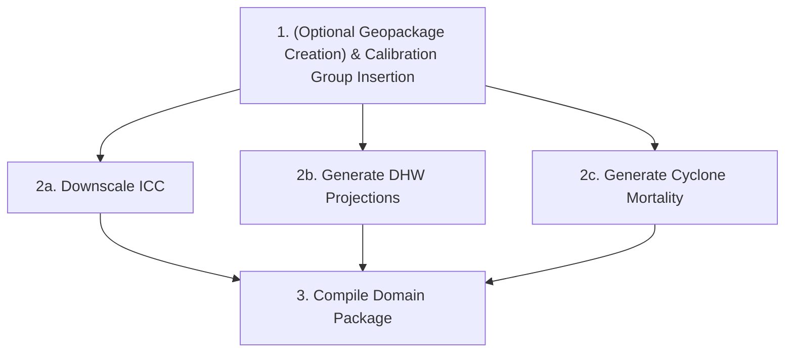

# Domain Build Guide

This guide provides a step-by-step walkthrough of building a clustered ADRIA-compatible domain package using the `rrap-dg` command-line tools.

---

## Workflow Overview

The domain generation process consists of three main stages:



---

## Step 1: (Optional Geopackage Creation) & Calibration Group Insertion

Define the clustered spatial boundary (see the [Available Clusters & Geopackages](modules/cluster-resources.md#available-clusters-geopackages) section in the [Cluster Resources](modules/cluster-resources.md) guide) and map calibration groups (`CB_CALIB_GROUPS`) and carrying capacities (`k` values) from a canonical geopackage.

1. **(Optional) Run Clustering:**
   If you do not have a pre-clustered geopackage, cluster the canonical geopackage locations using k-means:
   ```bash
   uv run rrapdg domain cluster <CANONICAL_GPKG_PATH> <CLUSTER_GPKG_PATH>
   ```
2. **Apply Calibration Mapping Fallbacks:**
   Map carrying capacity and calibration groups onto the cluster geopackage:
   ```bash
   uv run rrapdg domain update-cb-calib-groups \
     --cluster-gpkg <CLUSTER_GPKG_PATH> \
     --canonical-gpkg <CANONICAL_GPKG_PATH>
   ```

---

## Step 2a: Downscale Initial Coral Cover (ICC)

Downscale the Initial Coral Cover data from the source data package to match your target cluster's locations and carrying capacity ($k$):

```bash
uv run rrapdg coral-cover downscale-icc <SOURCE_DPKG_PATH> <CLUSTER_GPKG_PATH> <FORMATTED_DIR>/coral_cover.nc
```

---

## Step 2b: Generate Cluster-Specific DHW Projections

Generate stochastic Degree Heating Week projections for the specific cluster name, utilizing satellite NOAA baselines, MIROC5 CMIP6 trends, and local RECOM heatwave spatial patterns (see the [Available RECOM Datasets](modules/cluster-resources.md#available-recom-datasets) section in the [Cluster Resources](modules/cluster-resources.md) guide).

```bash
uv run rrapdg dhw generate \
  --gpkg-path <CLUSTER_GPKG_PATH> \
  --recom-dir <RECOM_DIR_PATH> \
  <CLUSTER_NAME> <SHARED_INPUT_DIR> <FORMATTED_DIR>/DHWs
```

*Note: `<SHARED_INPUT_DIR>` must contain the `NOAA/`, `MIROC5/`, and `spatial/` subdirectories.*

---

## Step 2c: Generate Cyclone Mortality

Generate a cluster-specific cyclone mortality NetCDF datacube using the RME cyclone scenarios and target cluster spatial geometries:

```bash
uv run rrapdg cyclones generate \
  --cluster-name <CLUSTER_NAME> \
  <FORMATTED_DIR> <RME_ROOT_DIR> <FORMATTED_DIR>/cyclones
```

---

## Step 3: Compile and Finalize the Domain Package

Assemble the processed and generated components into the final ADRIA domain package structure (matching the standard [Standard Data Package Layout](modules/cluster-resources.md#standard-data-package-layout)), writing the standard `datapackage.json` metadata containing full dataset provenance.

*Note: The connectivity files must be provided directly by the user and must already be aligned with the canonical geopackage.*

```bash
uv run rrapdg template build \
  --domain-path <FINAL_DOMAIN_PACKAGE_DIR> \
  --domain-name <CLUSTER_NAME> \
  --spatial-source <CLUSTER_GPKG_PATH> \
  --dhw-source <FORMATTED_DIR>/DHWs \
  --connectivity-source <PATH_TO_USER_CONNECTIVITY_DIR> \
  --icc-source <FORMATTED_DIR>/coral_cover.nc \
  --cyclones-source <FORMATTED_DIR>/cyclones
```

The output package directory `<FINAL_DOMAIN_PACKAGE_DIR>` is now ready to be loaded directly into modelling frameworks like ADRIA.
