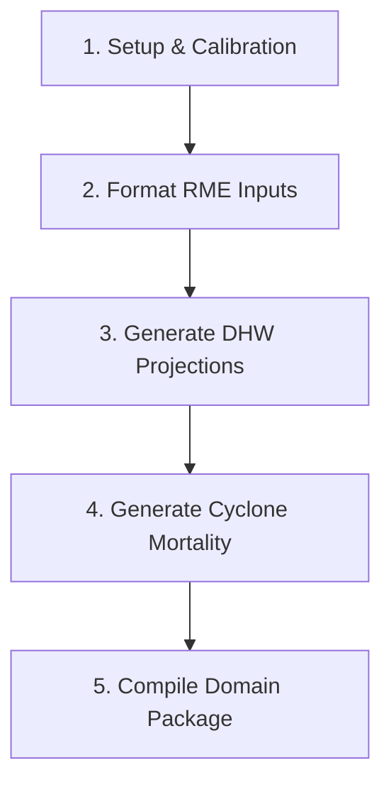

# Domain Build Guide

This guide provides a step-by-step walkthrough of building a clustered ADRIA-compatible domain package using the `rrap-dg` command-line tools.

---

## Workflow Overview

The domain generation process consists of five main phases:



---

## Step 1: Spatial Domain & Calibration Setup

First, define the clustered spatial boundary and map calibration groups (`CB_CALIB_GROUPS`) and carrying capacities (`k` values) from a canonical geopackage.

1. **(Optional) Run Clustering:**
   If you do not have a pre-clustered geopackage, cluster the canonical geopackage locations using k-means:
   ```bash
   uv run rrapdg domain cluster <CANONICAL_GPKG_PATH> <CLUSTER_GPKG_PATH>
   ```
2. **Apply Calibration Mapping Fallbacks:**
   Map carrying capacity and calibration groups onto the cluster geopackage:
   ```bash
   uv run rrapdg domain update-cb-calib-groups \
     --cluster-gpkg <CLUSTER_GPKG_PATH> \
     --canonical-gpkg <CANONICAL_GPKG_PATH>
   ```

---

## Step 2: Format RME Input Data

Format and align the raw ReefMod Engine (RME) input datasets with the canonical `UNIQUE_ID`s.

1. **Reformat Connectivity CSVs:**
   ```bash
   uv run rrapdg format rme-connectivity \
     --input-path <RME_ROOT_DIR> \
     --canonical-path <CANONICAL_GPKG_PATH> \
     --output-path <FORMATTED_DIR>/connectivity
   ```
2. **Reformat Initial Coral Cover (ICC):**
   ```bash
   uv run rrapdg format rme-icc \
     --input-path <RME_ROOT_DIR> \
     --canonical-path <CANONICAL_GPKG_PATH> \
     --output-path <FORMATTED_DIR>/coral_cover.nc
   ```

---

## Step 3: Generate Cluster-Specific DHW Projections

Generate stochastic Degree Heating Week projections for the specific cluster name, utilizing satellite NOAA baselines, MIROC5 CMIP6 trends, and local RECOM heatwave spatial patterns.

```bash
uv run rrapdg dhw generate \
  --gpkg-path <CLUSTER_GPKG_PATH> \
  --recom-dir <RECOM_DIR_PATH> \
  <CLUSTER_NAME> <SHARED_INPUT_DIR> <FORMATTED_DIR>/DHWs
```

*Note: `<SHARED_INPUT_DIR>` must contain the `NOAA/`, `MIROC5/`, and `spatial/` subdirectories.*

---

## Step 4: Generate Cyclone Mortality

Generate a cluster-specific cyclone mortality NetCDF datacube using the RME cyclone scenarios and target cluster spatial geometries:

```bash
uv run rrapdg cyclones generate \
  --cluster-name <CLUSTER_NAME> \
  <FORMATTED_DIR> <RME_ROOT_DIR> <FORMATTED_DIR>/cyclones
```

---

## Step 5: Compile and Finalize the Domain Package

Assemble the processed and generated components into the final ADRIA domain package structure, writing the standard `datapackage.json` metadata containing full dataset provenance:

```bash
uv run rrapdg template build \
  --domain-path <FINAL_DOMAIN_PACKAGE_DIR> \
  --domain-name <CLUSTER_NAME> \
  --spatial-source <CLUSTER_GPKG_PATH> \
  --dhw-source <FORMATTED_DIR>/DHWs \
  --connectivity-source <FORMATTED_DIR>/connectivity \
  --icc-source <FORMATTED_DIR>/coral_cover.nc \
  --cyclones-source <FORMATTED_DIR>/cyclones
```

The output package directory `<FINAL_DOMAIN_PACKAGE_DIR>` is now ready to be loaded directly into modelling frameworks like ADRIA.
